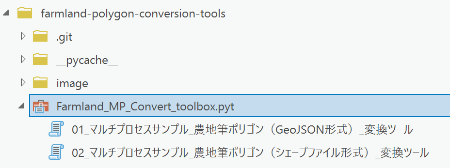

# Farmland polygon conversion tools

## 概要
  
このページでは、弊社の開発者ブログ「[ArcGIS の Python でのマルチプロセス処理](https://community.esri.com/t5/arcgis-%E9%96%8B%E7%99%BA%E8%80%85%E3%82%B3%E3%83%9F%E3%83%A5%E3%83%8B%E3%83%86%E3%82%A3-documents/arcgis-%E3%81%AE-python-%E3%81%A7%E3%81%AE%E3%83%9E%E3%83%AB%E3%83%81%E3%83%97%E3%83%AD%E3%82%BB%E3%82%B9%E5%87%A6%E7%90%86/ta-p/910452)」 で紹介したベストプラクティスに従って、「[農地の区画情報（筆ポリゴン）のデータ](https://www.maff.go.jp/j/tokei/porigon/)」 の変換処理を実装したサンプルプログラム、およびジオプロセシングツール（[Python ツールボックス](https://pro.arcgis.com/ja/pro-app/latest/arcpy/geoprocessing_and_python/a-quick-tour-of-python-toolboxes.htm)）を提供しています。  

変換可能なデータは、[農地の区画情報（筆ポリゴン）のデータ](https://www.maff.go.jp/j/tokei/porigon/) からダウンロード可能な、GeoJSON ファイル もしくはシェープファイル です。  

本ツールでは、ダウンロードして解凍したフォルダーを入力として、
  1. 各市区町村のファイル ジオデータベース(FGDB) を作成し、農地の筆界ポリゴンをフィーチャクラスへ変換（※この処理をマルチプロセスで実行）
  2. 都道府県ファイル ジオデータベース(FGDB) を作成し、1.の各市区町村のフィーチャクラスを、都道府県のフィーチャクラスとして統合
  3. 各市区町村のファイル ジオデータベース(FGDB) を削除

の処理を実施します。  
結果として、最終的には都道府県ファイル ジオデータベース(FGDB) に、農地の筆界ポリゴン（フィーチャクラス）として、統合されたものだけが残ります。  
  
## ジオプロセシング ツール と プログラム
Pythonスクリプトファイル（MP_Farmland_JsonToFeatureClass.py , MP_Farmland_ShapefileToFeatureClass.py）を、コマンドプロンプト から実行しても利用可能ですが、[ファイル一式](https://github.com/EsriJapan/farmland-polygon-conversion-tools/releases/download/v1.0.0/farmland-polygon-conversion-tools.zip) を入手し解凍後、ArcGIS Pro へ ツールボックス を追加することで、ジオプロセシング ツールとして利用することも可能です。  
  

  

**[農地筆ポリゴン変換 サンプルツールボックス]** : `Farmland_MP_Convert_toolbox.pyt`  
  
* **[01_マルチプロセスサンプル_農地筆ポリゴン（GeoJSON形式）_変換ツール]**
GeoJSON 形式の農地筆ポリゴン を ArcGIS のフィーチャクラス に変換するジオプロセシングツールです。内部で `MP_Farmland_JsonToFeatureClass.py` の処理を呼び出しています。  

* **[02_マルチプロセスサンプル_農地筆ポリゴン（シェープファイル形式）_変換ツール]** : 
シェープファイル形式の農地筆ポリゴン を ArcGIS のフィーチャクラス に変換するジオプロセシングツールです。内部で `MP_Farmland_ShapefileToFeatureClass.py` の処理を呼び出しています。  
※入手したシェープファイルのLDID（Language driver ID）と、ArcGIS Pro の設定によっては、文字化けが発生して正しく変換出来ない場合があります。対処方法などの詳細は、[シェープファイルや DBF ファイルが文字化けする](https://tech-support.esrij.com/arcgis/article/web/knowledge2880.html) をご確認いただき、それぞれの環境に見合った対応策を実施して下さい。  
  
  
**コマンドプロンプトからの実行例**
  Python Command Prompt （ [スタート] - [ArcGIS] - [Python Command Prompt] から起動）での実行例です。  
```
python.exe "your_dir\MP_Farmland_JsonToFeatureClass.py" "your_dir\2024_04" "your_dir\2024_04_宮城県filegdb" 4
```

説明：
  - 第1引数: 農地筆ポリゴンの変換で使うPython スクリプトファイルを指定します
    - GeoJSON形式の場合：MP_Farmland_JsonToFeatureClass.py、
    - シェープファイル形式の場合：MP_Farmland_ShapefileToFeatureClass.py
  - 第2引数: 農地筆ポリゴンをダウンロード後、解凍したフォルダーを指定します
  - 第3引数: 最終的な都道府県ファイル ジオデータベース(FGDB) の保存先フォルダーを指定します
    - 空のフォルダーを指定してください
  - 第4引数: マルチプロセス処理で使うCPUコア数を指定します


## 動作確認した環境
本ツールの動作確認は、ArcGIS Pro 3.3 / Python 3.9 の環境で実施しています。  

## 免責事項
* 本リポジトリに含まれるジオプロセシングツール（[Python ツールボックス](https://pro.arcgis.com/ja/pro-app/latest/arcpy/geoprocessing_and_python/a-quick-tour-of-python-toolboxes.htm)）、および サンプルプログラム はサンプルとして提供しているものであり、動作に関する保証、および製品ライフサイクルに従った Esri 製品サポート サービスは提供しておりません。
* 本ツールに含まれるツールによって生じた損失及び損害等について、一切の責任を負いかねますのでご了承ください。
* 弊社で提供しているEsri 製品サポートサービスでは、本ツールに関しての Ｑ＆Ａ サポートの受付を行っておりませんので、予めご了承の上、ご利用ください。詳細は[
ESRIジャパン GitHub アカウントにおけるオープンソースへの貢献について](https://github.com/EsriJapan/contributing)をご参照ください。

## ライセンス
Copyright 2025 Esri Japan Corporation.

Apache License Version 2.0（「本ライセンス」）に基づいてライセンスされます。あなたがこのファイルを使用するためには、本ライセンスに従わなければなりません。
本ライセンスのコピーは下記の場所から入手できます。

> http://www.apache.org/licenses/LICENSE-2.0

適用される法律または書面での同意によって命じられない限り、本ライセンスに基づいて頒布されるソフトウェアは、明示黙示を問わず、いかなる保証も条件もなしに「現状のまま」頒布されます。本ライセンスでの権利と制限を規定した文言については、本ライセンスを参照してください。

ライセンスのコピーは本リポジトリの[ライセンス ファイル](./LICENSE)で利用可能です。
